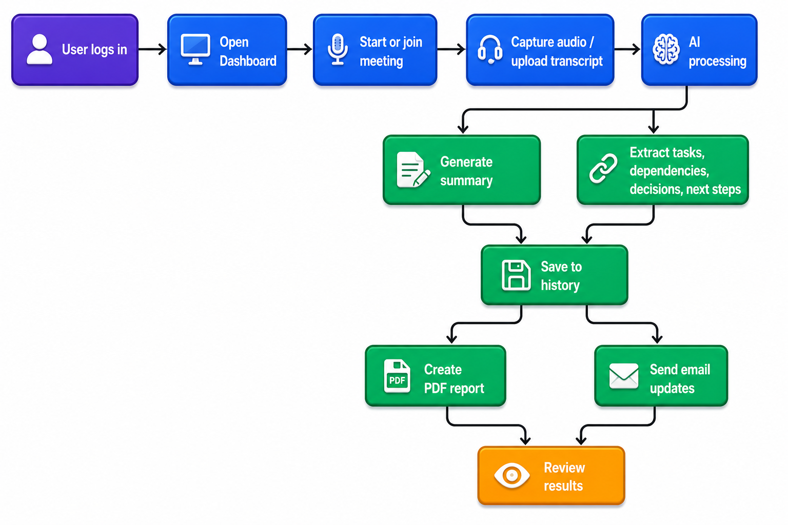
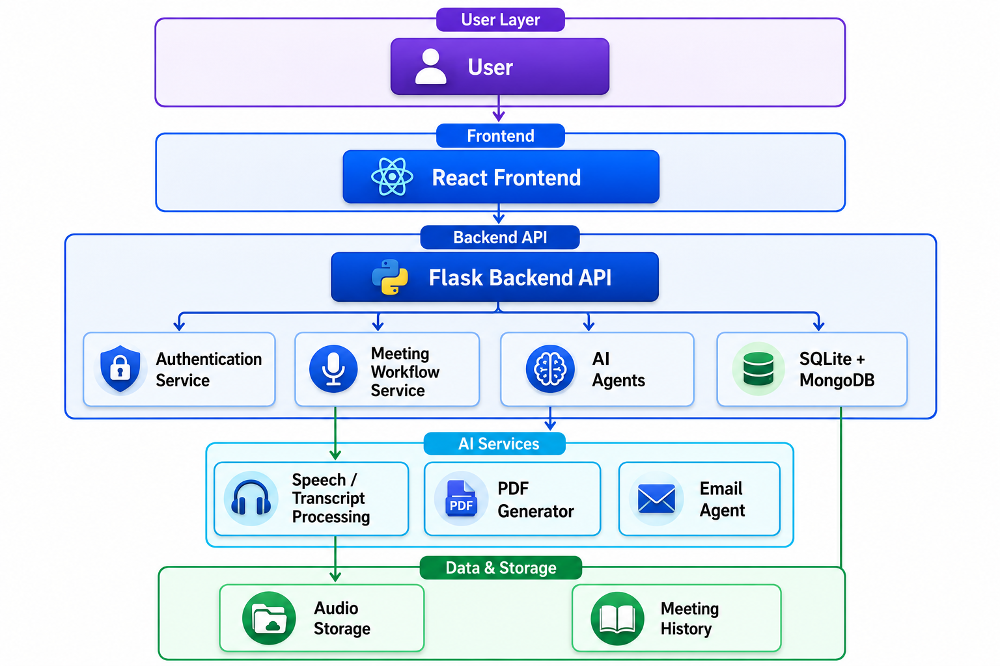

# AI Meeting Assistant

AI Meeting Assistant is an end-to-end meeting intelligence platform that helps teams capture, understand, and act on what happens during meetings. The system can join a meeting, process the conversation, generate structured outputs, save them to history, and share them as a polished PDF or email report.

This project is designed for users who want to turn raw meeting discussion into useful business artifacts such as summaries, task lists, dependencies, key decisions, and next steps.

## What this project does

- Lets users log in and manage meeting-related workflows
- Supports meeting start, recording, and transcript processing
- Extracts AI-generated summaries and action items
- Identifies key decisions, dependencies, and follow-up tasks
- Stores meeting history and allows review of previous conversations
- Generates downloadable PDF reports and sends email updates to recipients

## Main features

- Authentication and user management
- Dashboard for meeting workflow control
- Meeting history and transcript review
- AI-powered summarization and extraction
- PDF generation for meeting reports
- Email dispatch to selected recipients
- Support for meeting join and processing flows

## Tech stack

### Frontend
- React
- Vite
- React Router
- CSS and custom UI components

### Backend
- Flask
- Python
- SQLite for meeting history
- MongoDB for user authentication data
- Groq-powered AI processing

## Project flow

<div align="center">
  
</div>

## Architecture diagram

<div align="center">
  
</div>

## Project structure

- src/frontend: React app and pages
- src/backend: Flask API, routes, services, and models
- src/backend/services: AI agents for summarization, task extraction, dependency analysis, email handling, and meeting processing
- src/backend/routes: authentication and meeting management endpoints
- src/backend/models: database and meeting history logic

## Getting started

### Prerequisites

- Python 3.10+
- Node.js 18+
- npm

### 1. Clone the repository

```bash
git clone <your-repo-url>
cd ai_meeting_project
```

### 2. Set up the backend

```bash
cd src/backend
python -m venv venv
source venv/bin/activate   # On Windows: venv\Scripts\activate
pip install -r ../../requirements.txt
```

### 3. Set up the frontend

```bash
cd ../../
npm install
```

### 4. Run the application

Start the backend:

```bash
cd src/backend
python app.py
```

Start the frontend in a new terminal:

```bash
npm run dev
```

The frontend will usually run at http://localhost:5173 and the backend at http://127.0.0.1:5000.

## Typical usage flow

1. Sign up or log in.
2. Open the dashboard.
3. Start a meeting or upload a transcript.
4. Let the system process the conversation.
5. Review the generated summary, action items, and decisions.
6. Download the PDF report or send it by email.

## API highlights

The backend exposes endpoints for:

- Authentication: /auth/signup, /auth/login, /auth/verify
- Meeting workflows: /meeting/start, /meeting/stop, /meeting/process
- History and reporting: /history, /history/<id>, /download-pdf

## Future improvements

Possible next steps for the project include:

- Better real-time meeting integration
- Improved speaker diarization and transcript accuracy
- More analytics and dashboard insights
- Multi-language support
- Cloud deployment and production-ready authentication

## License

This project is currently intended for personal or internal use. Add your preferred license if you plan to share it publicly.
